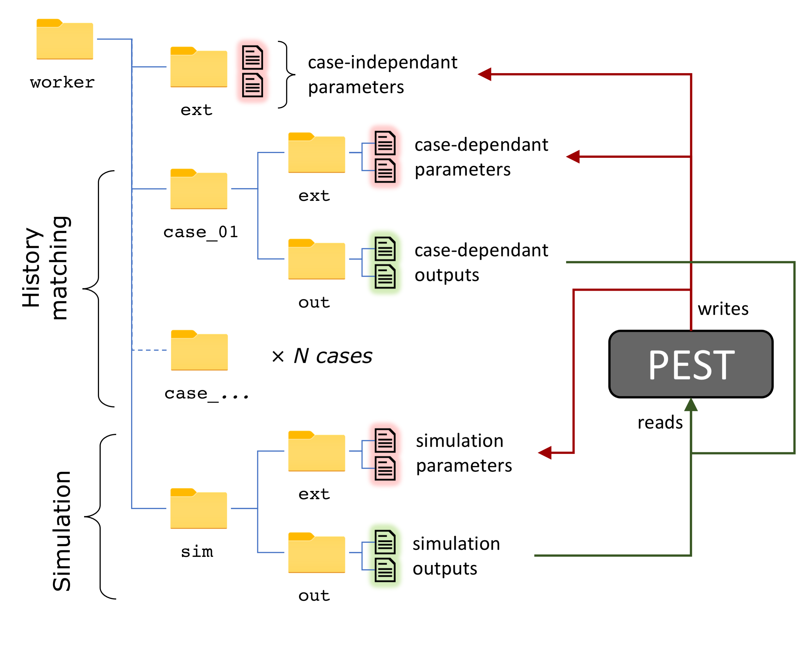

Overview
-----------------------------------------------

This case-study illustrates the potential of the [TrackTools](https://github.com/tracktools/tracktools) library on a real-world study site presented by [Cousquer et al., 2018](https://doi.org/10.1016/j.jhydrol.2018.01.043). The model simulates steady-state flow with [MODFLOW6](https://www.usgs.gov/software/modflow-6-usgs-modular-hydrologic-model) on a 2D unstructured grid. Particle tracking is conducted with [MODPATH7](https://pubs.er.usgs.gov/publication/ofr20161086). 

This case study also provides an example of interfacing with the [PESTPP++](https://github.com/usgs/pestpp/) suite considering a series of pseudo steady states. Observations used for history matching were collected during historic surveys with contrasting climatic and operation settings, hereafter named *cases*. A generic *template* model is generated and replicated for each of the historic cases.

The workflow is fully script-based with 3 main steps :  
- Model set up with [FloPy](https://github.com/modflowpy/flopy)
- Parameter estimation with [PESTPP-GLM](https://github.com/usgs/pestpp/).
- Optimization by sequential linear programming with [PESTPP-OPT](https://github.com/usgs/pestpp/)


[PyEMU](https://github.com/pypest/pyemu) is used for the processing of [PESTPP++](https://github.com/usgs/pestpp/) files and [TrackTools](https://github.com/tracktools/tracktools) handles particle generation and post-processing of [MODPATH7](https://pubs.er.usgs.gov/publication/ofr20161086) files.   More details provided below, the corresponding Python scripts should be run in this sequence.


Model setup
-----------------------------------------------

```sh
python setup_ml.py
```
- 2D unstructured grid generation with [GridGen](https://www.usgs.gov/software/gridgen-program-generating-unstructured-finite-volume-grids)
- Grid intersections for the implementation of boundary conditions with [FloPy](https://github.com/modflowpy/flopy)
- Set up of a *template* flow and particle tracking model with [FloPy](https://github.com/modflowpy/flopy) and [TrackTools](https://github.com/tracktools/tracktools). 
- Replication of the template model for all or a selection of historic *cases*.
- Test model run with a dedicated function provided in the `helpers` Python module.

Initial parameter values are provided in `/data/par.xlsx`. Case-specific settings are provided in `/data/surveys.xlsx`. 


Parameter estimation
-----------------------------------------------

```sh
python setup_pst.py
```
- Initialization of the `PstFrom` class and processing of case-independent parameters : hydraulic properties with pilot points, boundary conditions.
- Processing of case-specific parameters and observations.
- Processing of the PEST control file
- Execution of PESTPP-GLM in parallel.

The model directory replicated with`pyemu.helpers.start_workers()`. Worker directories contain an `ext` directory where parameter common to all the cases are written. Case-specific parameters and simulation outputs are written in the `ml_[id]` sub-directories. 

<p align="center">

</p>

The case with id=99 corresponds to the simulation case for the optimization, it is not considered for parameter estimation.

Post-processing is conducted with `pproc_pst.py`. Model files with the "best" parameter set in the `store` directory.


SLP optimization
-----------------------------------------------

```sh
python setup_opt.py
```

- Setup of the simulation case with calibrated parameters from the `store` directory.
- Initialization of the `PstFrom` class for the optimization of decision variables.
- Processing of the PEST control file 
- Execution of PESTPP-OPT.

Post-processing is conducted with `pproc_opt.py`.

Requirements
-----------------------------------------------

Tested with Python 3.8.2

*TrackTools*

The `tracktools.py` module should be accessible to Python from where the scripts are run. To do so, you may copy paste this module in the `case_study` folder or, preferably, clone the [TrackTools](https://github.com/tracktools/tracktools) repository and append this location to your `PYTHONPATH` environment variable.


*Python packages*

- Numpy 1.21.12
- Pandas 1.3.5
- FloPy 3.3.6


*Binaries*

Binaries for Windows, Mac, and Linux (Ubuntu distribution) can be found in the `binaries` directory of this repository. 

- modflow6 Version **6.2.2** 07/30/2021
- modpath7 Version 7.2.001
- gridgen 1.0.02 January 6, 2017

**Note on the MODFLOW6 version** : Incompatibilities have been reported with the binary budget file (.cbc) written by the latest version of Modflow 6.3.0 and modpath7 Version 7.2.001

Ressources
-----------------------------------------------

- [FloPy documentation (latest release)](https://flopy.readthedocs.io).
- [MODFLOW and Related Programs](https://water.usgs.gov/ogw/modflow/)
- [PEST++ - GitHub page](https://github.com/usgs/pestpp)
- [pyEMU - GitHub page](https://github.com/pypest/pyemu)
